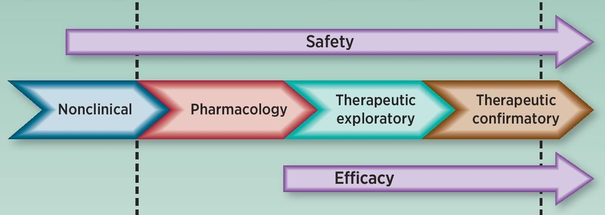
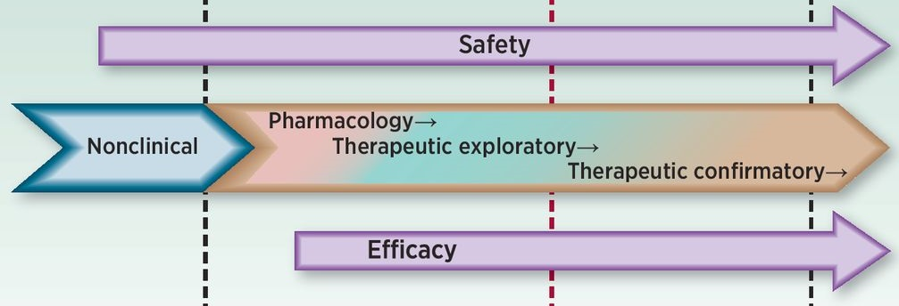
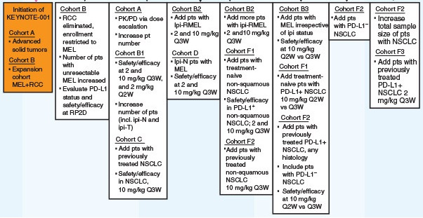
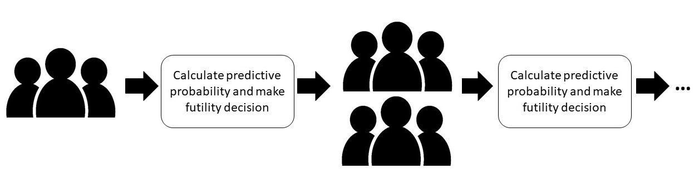

class: inverse, center, middle
# Motivation

---
# Traditional oncology trial design

.large[
- Focus on **cytotoxic** treatments
- Primary aim of identifying the **maximum tolerated dose** (MTD)
- Use of the 3+3 design or model-based design
]

 

.small[Image source: Theoret MR, Pai-Scherf LH, Chuk MK, Prowell TM, Balasubramaniam S, Kim T, Kim G, Kluetz PG, Keegan P, Pazdur R. Expansion Cohorts in First-in-Human Solid Tumor Oncology Trials. Clin Cancer Res. 2015 Oct 15;21(20):4545-51.]

---
# Seamless oncology trial design

.large[
- Focus shifting to **non-cytotoxic** treatments
- MTD may not exist or be relevant
- **Dose-expansion** cohorts becoming increasingly common
]

 

.small[Image source: Theoret MR, Pai-Scherf LH, Chuk MK, Prowell TM, Balasubramaniam S, Kim T, Kim G, Kluetz PG, Keegan P, Pazdur R. Expansion Cohorts in First-in-Human Solid Tumor Oncology Trials. Clin Cancer Res. 2015 Oct 15;21(20):4545-51.]

---
# Dose-expansion in KEYNOTE-001 

.small[Image source: Kang SP, Gergich K, Lubiniecki GM, de Alwis DP, Chen C, Tice MAB, Rubin EH. Pembrolizumab KEYNOTE-001: an adaptive study leading to accelerated approval for two indications and a companion diagnostic. Ann Oncol. 2017 Jun 1;28(6):1388-1398.]

---
# {ppseq} solution: predictive probability monitoring

.large[
- Done **sequentially** to allow for early stopping
- Bayesian approach allows for **flexibility** in number and timing of looks
- Can maintain traditional levels of **type I error** and **power**
]

 

.small[Icon source: https://www.vecteezy.com/free-vector/human]