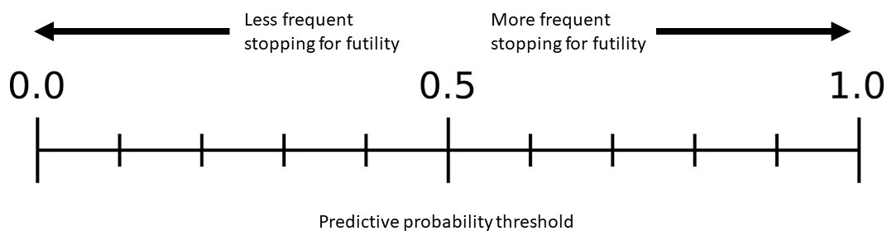

class: inverse, center, middle
# Predictive probability

---
# Hypothetical trial design and data

.large[
- $n$ patients at interim analysis, maximum of $N$ total enrolled patients

- $H_0: p \leq p_0$ versus $H_1: p \geq p_1$
]

---
# Posterior probability

.large[
Prior: $\pi(p) \sim Beta(a_0, b_0)$

Data: $X \sim binomial(n, p)$

Posterior: $p|x \sim Beta(a_0 + x, b_0 + n - x)$
  - Probability of success based on data **accrued so far**
  
  - Success if $Pr(p > p_0 | X)>\theta$ for **posterior threshold $\theta$**
]

---
# Posterior predictive probability

.large[
Probability that the treatment will be declared efficacious at the **end of the trial**:

.center[
$PPP = \sum_{x^* = 0}^{n^*} Pr(X^* = x^* | x) \times I(Pr(p > p_0 | X, X^* = x^*) > \theta)$
]

Stop the trial early for **futility** if:

.center[
$PPP < \theta^*$
]
]

 

