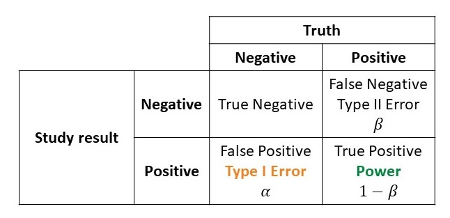

class: inverse, center, middle
# Package overview and example


---
# Installing {ppseq}

.large[
**Development** version from GitHub: `remotes::install_github("zabore/ppseq")`

**.green[Coming soon!]** **Production** version from CRAN: `install.packages("ppseq")`
]


---
# Atezolizumab for mUC

<p align="center"></p>

.small[
https://www.cancernetwork.com/view/atezolizumab-indication-in-us-withdrawn-for-previously-treated-metastatic-urothelial-cancer
https://www.onclive.com/view/roche-withdraws-atezolizumab-prior-platinum-treated-metastatic-bladder-cancer-indication-in-the-united-states
https://ascopost.com/news/march-2021/atezolizumab-s-indication-in-previously-treated-metastatic-bladder-cancer-is-withdrawn/
]


---
# Original dose-expansion design

.large[
**Primary aim**: evaluate safety, pharmacodynamics, pharmacokinetics

* Expansion cohort in mUC not originally planned

* Added through **protocol amendment**

* Enrolled **95 patients**

* Single **futility look**: stop if 0 responses in first 14 patients

    - At most 4.4% chance of no responses if true rate is 20% or higher
]

<br>
<br>

.small[
Powles T, Eder JP, Fine GD, Braiteh FS, Loriot Y, Cruz C, Bellmunt J, Burris HA, Petrylak DP, Teng SL, Shen X, Boyd Z, Hegde PS, Chen DS, Vogelzang NJ. MPDL3280A (anti-PD-L1) treatment leads to clinical activity in metastatic bladder cancer. Nature. 2014 Nov 27;515(7528):558-62
]


---
# Re-design of dose-expansion study

.large[
* Assume **null** rate of 0.1 and **alternative** rate of 0.2

* Maximum sample size **N = 95**

* Check for futility after **every 5 patients**

* **Posterior thresholds**: 0, 0.7, 0.74, 0.78, 0.82, 0.86, 0.9, 0.92, 0.93, 0.94, 0.95, 0.96,
0.97, 0.98, 0.99, 0.999, 0.9999, 0.99999, and 1

* **Predictive thresholds**: 0.05, 0.1, 0.15, and 0.2

]


---
# Determine type I error and power

<p align="center"></p>

.large[
- Need to determine **type I error** and **power** of decision thresholds
- Use `calibrate_thresholds()` to evaluate a grid of thresholds
  - Jointly calibrates **posterior** and **predictive** thresholds
]


---
# calibrate_thresholds()

```{r}
library(ppseq)
```

```{r eval = FALSE}
one_sample_cal_tbl <-
  calibrate_thresholds(
    p_null = 0.1,
    p_alt = 0.2,
    n = seq(5, 95, 5),
    N = 95,
    pp_threshold = c(0, 0.7, 0.74, 0.78, 0.82, 0.86, 0.9, 0.92, 0.93, 0.94,
                     0.95, 0.96, 0.97, 0.98, 0.99, 0.999, 0.9999, 0.99999, 1),
    ppp_threshold = seq(0.05, 0.2, 0.05),
    direction = "greater",
    delta = NULL,
    prior = c(0.5, 0.5),
    S = 5000,
    nsim = 1000
    )
```


---
# print() calibrate_thresholds() resuts

```{r eval = FALSE}
print(one_sample_cal_tbl, type1_range = c(0.05, 0.1), minimum_power = 0.7)
```

.scroll-output[
```{r echo = FALSE}
# gt::gt(dplyr::filter(one_sample_cal_tbl$res_summary, 
#                      prop_pos_null >= 0.01, 
#                      prop_pos_null <= 0.2, 
#                      prop_pos_alt >= 0.7))

# For now I need to hack together all of the results, pending the new sim results
# Changes to the functions since these data were produced are making them incompatible

load("H:/ppseq-papers/one-sample-expansion-cohort/sim_results/atez_sim_study_1.rda")

gt::gt(dplyr::filter(atez_sim_study_1$res_summary,
                     prop_pos_null >= 0.05,
                     prop_pos_null <= 0.1,
                     prop_pos_alt >= 0.7))
```
]


---
# optimize_design()

```{r eval = FALSE}
optimize_design(
  one_sample_cal_tbl,
  type1_range = c(0.05, 0.1),
  minimum_power = 0.7
)
```

```{r echo = FALSE, message = FALSE}
# opt <- 
#   optimize_design(
#   one_sample_cal_tbl,
#   type1_range = c(0.01, 0.2),
#   minimum_power = 0.7
# )

library(dplyr)

type1_range <- c(0.05, 0.1)
minimum_power <- 0.7

opt_x <-
  atez_sim_study_1$res_summary %>% 
  filter(
    prop_pos_null >= type1_range[1] &
      prop_pos_null <= type1_range[2] &
      prop_pos_alt >= minimum_power
  ) %>% 
  mutate(
    ab_dist_metric = ((prop_pos_null - 0)^2 +
                        (prop_pos_alt - 1)^2)^(1 / 2),
    n_dist_metric = ((mean_n1_null - min(mean_n1_null))^2 +
                       (mean_n1_alt - max(mean_n1_alt))^2)^(1 / 2)
  ) %>% 
  rename(
    `Type I error` = prop_pos_null,
        Power = prop_pos_alt,
        `Average N under the null` = mean_n1_null,
        `Average N under the alternative` = mean_n1_alt,
        `Distance to optimal efficiency` = n_dist_metric,
        `Distance to optimal accuracy` = ab_dist_metric
  )

opt_ab <-
  slice(
    group_by(
      arrange(
        opt_x,
        `Distance to optimal accuracy`, 
        -pp_threshold, 
        -ppp_threshold
        ),
      `Distance to optimal accuracy`
      ),
    1
    )

opt_nn <-
  slice(
    group_by(
      arrange(
        opt_x,
        `Distance to optimal efficiency`,
        -pp_threshold, 
        -ppp_threshold
        ),
      `Distance to optimal efficiency`
      ),
    1
    )

opt <- 
  list(
    "Optimal accuracy design:" =
      opt_ab[
        opt_ab$`Distance to optimal accuracy` == min(opt_ab$`Distance to optimal accuracy`),
        c(
          "pp_threshold", "ppp_threshold", "Type I error", "Power",
          "Average N under the null", "Average N under the alternative"
        )
      ],
    "Optimal efficiency design:" =
      opt_nn[
        opt_nn$`Distance to optimal efficiency` ==
          min(opt_nn$`Distance to optimal efficiency`),
        c(
          "pp_threshold", "ppp_threshold", "Type I error", "Power",
          "Average N under the null", "Average N under the alternative"
        )
      ]
  )
```

**Optimal accuracy design:**

```{r echo = FALSE}
gt::gt(opt$`Optimal accuracy design:`)
```

**Optimal efficiency design:**

```{r echo = FALSE}
gt::gt(opt$`Optimal efficiency design:`)
```


---
# plot()

```{r eval = FALSE}
plot(one_sample_cal_tbl, type1_range = c(0.01, 0.2), minimum_power = 0.7, plotly = TRUE)
```

```{r echo = FALSE, message = FALSE}
# ptest <- 
#   plot(one_sample_cal_tbl, 
#      type1_range = c(0.01, 0.2), 
#      minimum_power = 0.7,
#      plotly = TRUE)

library(ggplot2)
library(plotly)

plot_x <-
  rename(
    mutate(
      filter(
        atez_sim_study_1$res_summary,
        prop_pos_null >= type1_range[1] &
          prop_pos_null <= type1_range[2] &
          prop_pos_alt >= minimum_power
        ),
        Design = paste0(
          "Posterior threshold = ", pp_threshold,
          " and predictive threshold = ", ppp_threshold
        ),
        ab_dist_metric = ((prop_pos_null - 0)^2 +
          (prop_pos_alt - 1)^2)^(1 / 2),
        n_dist_metric = ((mean_n1_null - min(mean_n1_null))^2 +
          (mean_n1_alt - max(mean_n1_alt))^2)^(1 / 2)
      ),
      `Type I error` = prop_pos_null,
      Power = prop_pos_alt,
      `Average N under the null` = mean_n1_null,
      `Average N under the alternative` = mean_n1_alt,
      `Distance to optimal efficiency` = n_dist_metric,
      `Distance to optimal accuracy` = ab_dist_metric
    )

plot_ab <-
  mutate(
    ungroup(
      slice(
        group_by(
          arrange(
            plot_x,
            `Distance to optimal accuracy`,
            -pp_threshold,
            -ppp_threshold
          ),
          `Distance to optimal accuracy`
        ),
        1
      )
    ),
    optimal_accuracy = ifelse(row_number() == 1, TRUE, FALSE)
  )

plot_nn <-
  mutate(
    ungroup(
      slice(
        group_by(
          arrange(
            plot_x,
            `Distance to optimal efficiency`,
            -pp_threshold, -ppp_threshold
          ),
          `Distance to optimal efficiency`
        ),
        1
      )
    ),
    optimal_efficiency = ifelse(row_number() == 1, TRUE, FALSE)
  )

p1 <-
  ggplot(
    plot_ab,
    aes(
      x = `Type I error`,
      y = Power,
      color = `Distance to optimal accuracy`,
      Design = Design,
      `Average N under the null` = `Average N under the null`,
      `Average N under the alternative` = `Average N under the alternative`
    )
  ) +
  geom_point(
    shape = ifelse(plot_ab$optimal_accuracy == TRUE, 18, 19),
    size = ifelse(plot_ab$optimal_accuracy == TRUE, 4, 2)
  ) +
  ylim(0, 1) +
  xlim(0, 1) +
  labs(
    x = "Type I error",
    y = "Power"
  ) +
  scale_color_viridis_c() +
  theme_bw() +
  theme(legend.position = "bottom")

p2 <-
  ggplot(
    plot_nn,
    aes(
      x = `Average N under the null`,
      y = `Average N under the alternative`,
      color = `Distance to optimal efficiency`,
      Design = Design,
      `Type I error` = `Type I error`,
      Power = Power
    )
  ) +
  geom_point(
    shape = ifelse(plot_nn$optimal_efficiency == TRUE, 18, 19),
    size = ifelse(plot_nn$optimal_efficiency == TRUE, 4, 2)
  ) +
  ylim(
    min(plot_x$`Average N under the null`),
    max(plot_x$`Average N under the alternative`)
  ) +
  xlim(
    min(plot_x$`Average N under the null`),
    max(plot_x$`Average N under the alternative`)
  ) +
  labs(
    x = "Average N under the null",
    y = "Average N under the alternative"
  ) +
  scale_color_viridis_c() +
  theme_bw() +
  theme(legend.position = "bottom")
```

.pull-left[
**Accuracy:**
.center[
```{r echo = FALSE, fig.width = 6, fig.height = 5}
# ptest[[1]]

ggplotly(p1)
```
]
]

.pull-right[
**Efficiency:**
.center[
```{r echo = FALSE, fig.width = 6, fig.height = 5}
# ptest[[2]]

ggplotly(p2)
```
]
]


---
# Selected optimal design

.large[
.pull-left[
**Optimal efficiency design**

- 39 patients under the null on average

- Type I error of 0.06

- Power of 79.6%
]

.pull-left[
**Original design**

- 76 patients under the null on average

- Type I error of 0.005

- Power of 52.8%
]
]


---
# calc_decision_rules()

```{r eval = FALSE}
one_sample_decision_tbl <-
  calc_decision_rules(
    n = seq(5, 95, 5),
    N = 95,
    theta = 0.92,
    ppp = 0.1,
    p0 = 0.1,
    direction = "greater",
    delta = NULL,
    prior = c(0.5, 0.5),
    S = 5000
    )
```


---
# calc_decision_rules()

```{r eval = FALSE}
one_sample_decision_tbl
```

.scroll-output[
```{r echo = FALSE}
gt::gt(one_sample_decision_tbl)
```
]


---
# plot()

```{r eval = FALSE}
plot(one_sample_decision_tbl)
```


```{r echo = FALSE, message = FALSE, fig.width = 10, fig.height = 6, fig.align='center'}
# plot(one_sample_decision_tbl)

library(tidyr)
library(purrr)

x_2 <-  
  mutate(
    filter(
      one_sample_decision_tbl, 
      !is.na(r)
    ),
    stop_criteria = r
  )

shell <- 
  tibble(
    n = unlist(map(x_2$n, ~rep(.x, (.x + 1)))),
    r = unlist(map(x_2$n, ~seq(from = 0, to = .x)))
  )
    
plotdat <- 
  rename(
    ungroup(
      mutate(
        fill(
          group_by(
            full_join(
              shell, x_2
              ),
            n
            ),
          stop_criteria, .direction = "updown"
          ),
        Decision = case_when(
          r <= stop_criteria ~ "Stop",
          r > stop_criteria ~ "Proceed",
          is.na(stop_criteria) ~ "Proceed"
          ), 
        n = as.factor(n)
        )
      ),
    "# responses" = r,
    "N at interim analysis" = n
  )
    
p <- 
  ggplot(plotdat, aes(x = `N at interim analysis`, 
                       y = `# responses`, 
                       fill = Decision)) + 
  geom_tile(color = "black") + 
  scale_y_continuous(breaks = c(0, seq(5, 95, 5)), 
                     expand = c(0, 0)) + 
  scale_x_discrete(expand = c(0, 0)) +
  scale_fill_manual(values = c("#4DAF4A", "#E41A1C")) +
  theme_bw() +
  xlab("N at interim analysis")

ggplotly(p)
```


---
# Additional features

.large[
* All demonstrated functions also available for **two-sample case**

  - i.e. Experimental vs standard-of-care treatment arms

* `calibrate_thresholds()` is parallelized using the {future} and {furrr} packages

  - Set up a call to `future::plan()` appropriate for your system
  
  - Example:  `future::plan(future::multicore(workers = 76))`
]


